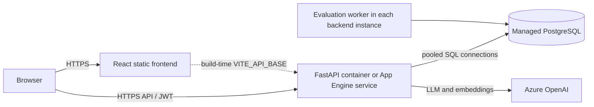
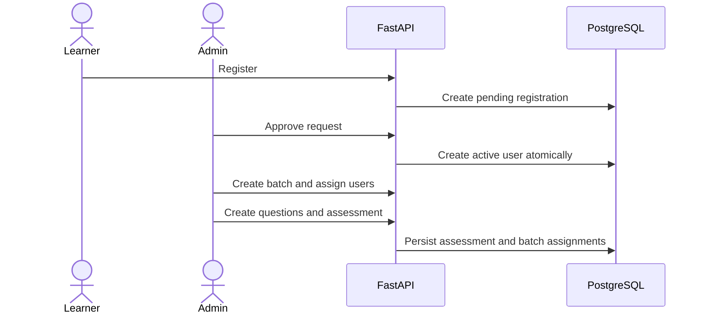
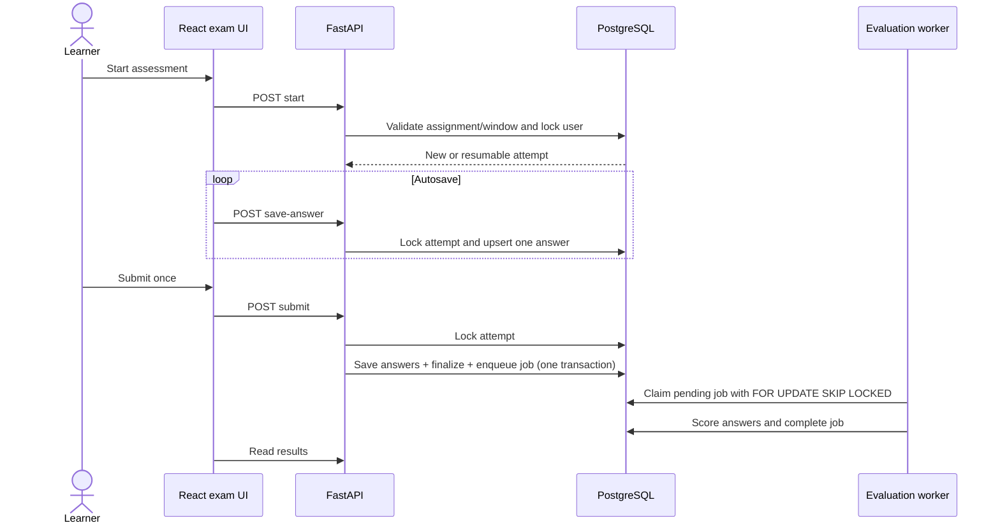
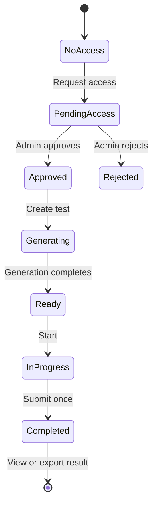
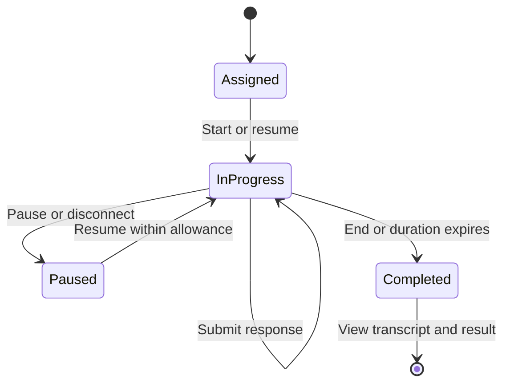

# Application Reference

## Purpose

This repository is an AI-powered assessment and training evaluation system. A React/Vite frontend communicates with a FastAPI backend. PostgreSQL stores users, batches, questions, assessments, attempts, and evaluation jobs. Azure OpenAI is used for question generation and subjective-answer evaluation.

## Primary workflow

1. A learner registers through `POST /auth/register`; this creates a pending `RegistrationRequest`.
2. An administrator approves it through `POST /admin/approve/{request_id}`, creating an active `User` account.
3. Administrators create batches, add users, and manage the question bank by topic, question type, and difficulty.
4. An administrator creates an assessment through `POST /assessments/create`. The backend selects unique matching questions, records sections, and assigns the assessment to batches.
5. An assigned learner starts through `POST /user/assessments/start/{assessment_id}`. The API verifies batch membership, timing, archive state, and existing attempts.
6. The learner autosaves answers and submits. MCQ/coding answers are evaluated automatically; text answers use the LLM. Results and topic performance become available after evaluation.
7. Practice-test and agentic-interview flows use their own routers and persistence models.

## Workflow diagrams

### Cloud deployment



Embedding storage is selected with `EMBEDDING_STORAGE_BACKEND`: `pgvector`
uses database cosine search, while `json` stores arrays and computes cosine
similarity in the backend as a temporary fallback.

The Docker frontend uses `/api`; Nginx proxies that path to the `backend`
service. Separate cloud services instead build the frontend with the public
backend URL as `VITE_API_BASE`.

### Registration and administration



### Assessment lifecycle and concurrency



Attempt row locks serialize autosave, violation, submit, and abort requests.
Evaluation workers use `SKIP LOCKED`, so multiple backend containers cannot
claim the same pending job.

### Practice workflow



### Interview workflow



## Important files

| Path | Responsibility |
| --- | --- |
| `backend/main.py` | App setup, router registration, startup tasks, health check. |
| `backend/db/models.py` | SQLAlchemy entities and enums. |
| `backend/db/database.py` | PostgreSQL engine and sync/async sessions. |
| `backend/core/auth.py` | Passwords, JWTs, user/admin dependencies. |
| `backend/api/routers_auth.py` | Registration, login, refresh, current user. |
| `backend/api/routers_batches.py` | Batch management and import. |
| `backend/api/routers_questions.py` | Question-bank management. |
| `backend/api/routers_assessments.py` | Admin assessment lifecycle and aggregate results. |
| `backend/api/routers_user_assessments.py` | Learner assessment start, save, submit, results, exports. |
| `backend/core/evaluation_service.py` | Background evaluation worker and scoring. |
| `backend/api/results_helpers.py` | Shared detailed result payload construction. |
| `backend/api/routers_practice.py` | Practice-test access and lifecycle. |
| `backend/api/routers_interviews.py` | Agentic interview lifecycle. |
| `frontend/src/api.ts` | Browser API client. |
| `frontend/src/pages/admin/` | Administrator UI. |
| `frontend/src/pages/user/` | Learner UI. |

## Assessment integrity rules

- Assessments are assigned through batches; unassigned users cannot start them.
- Existing attempts are resumed only within their duration; completed attempts cannot be re-submitted.
- Start/end windows, duration, and archive state govern access.
- Autosave, submit, and abort accept only question IDs selected for that assessment; unrelated answers are rejected.
- The final score divides earned points by every question selected for the assessment. Unanswered questions count as zero.
- Submission creates an `EvaluationJob`; the worker records scores, feedback, topic scores, and final percentage.

## Tests

The deployment-oriented suite is the standalone `TestSuite/` uv project. It
covers safe API contracts, role boundaries, concurrent requests, stateful
assessment races, and Playwright browser workflows. Stateful and browser tests
are explicitly enabled so shared cloud environments are not mutated by
default. See `TestSuite/README.md`.

Its stateful workflow provisions three users and an isolated four-question
assessment, then verifies full, partial, and violation-aborted attempts.
Learner result payloads are compared with administrator results for score,
answered count, question text, topic percentage, and user isolation.

Live integration tests are in `backend/tests/`.

- `conftest.py` provisions a test assessment, question bank, batch, test users, authentication, and cleanup.
- `test_assessment_lifecycle.py` covers full and partial submissions, autosave, tab-violation abort, access controls, recorded results, question-membership validation, and partial-score calculation.
- `test_authentication_and_users.py` covers registration, duplicate pending-registration rejection, admin approval, login, token refresh, current-user lookup, and deactivation.
- `test_browser_smoke.py` is an optional Playwright suite for browser login and dashboard routing.

Run from `backend/` with a local server and PostgreSQL available:

```powershell
uv run pytest tests/ -v
```

Set `DATABASE_URL`, `DEFAULT_ADMIN_PASSWORD`, and, if needed, `BASE_URL` and the `TEST_ADMIN_*` variables.

For browser tests, install `uv sync --extra e2e`, then `uv run playwright install chromium`. Start the backend and frontend, set `FRONTEND_URL` if it is not `http://localhost:5173`, and run `uv run pytest -m e2e -v`.
